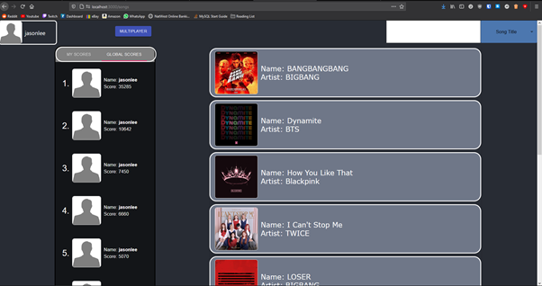
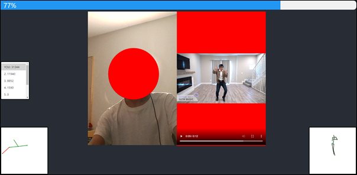
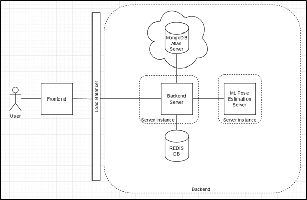

# JustDanceWithHumanPoseEstimation

This project is a web app game based on "Just Dance".
It uses human pose estimation to score the player's dance moves based on how closely it matches to the dancer. 



<br/>


---
## Stack

This project uses the MERN stack for the main web app along with python and flask for the pose estimation server.
Data is stored within a MongoDB Atlas cloud database.

To view the Swagger API documentation visit - http://localhost:8000/api-docs/ when the frontend server is running.


---
## Ways of working

For CI I used Travis-CI [here]()

Features are developed on separate branches which are then merged into the developement branch via a pull request. Pull Requests must have passing test suite checks before being allowed to merge in.

Ideally the dev branch should be merged into master after every release cycle.

---

## Setup
Note: This web application was developed in Windows 10. All the components should be compatible with Linux but do require different separate setups. 
1.	Clone repo to local directory
2.	Install [NodeJS](https://nodejs.org/en/download/)

Order of start-up:
1.	Redis
2.	Nginx (optional)
3.	Pose Server
4.	Backend
5.	Frontend



---
### Redis - Server
If you are on Linux, you can just install it normally following  [this](https://redis.io/topics/quickstart)

Windows users will need WSL and a Linux distribution (e.g., Ubuntu), you can follow these instructions [here](https://redislabs.com/blog/redis-on-windows-10/)

To start the Redis server run ```sudo /etc/init.d/redis-server start```
You can test if it is working by running:
```
redis-cli 
ping
```
You should see `PONG` outputted.
 
---

### Backend:
In a new terminal instance cd into /backend then run ```npm install```
This installs all the dependencies for the backend.
For your convenience, the .env file has the database username and password entered but to use the NodeMailer register email function you’ll need you add your own email and password. You will need to configure it depending on the provider – edit “sendEmail.js”. https://nodemailer.com/usage/using-gmail/

Note: you can run the application without the NGINX load balancer by changing the proxy in the frontend’s package.json from http://localhost:80 to http://localhost:8000. (default is http://localhost:8000)


If you want to use the load balancer, please skip to the NGINX section.

To start the client run ```nodemon server.js```. This spawns a backend server instance located on port 8000. 
The backend server has a few other dependencies which need to be run concurrently – Redis Server and Nginx process. It should automatically connect to the MongoDB cloud database as all connections are now allowed. 
You should see these messages:

```
Server listening on port:8000 – Backend server is online.
Connected to Redis Server – Redis server connection established.
Connected to Database – Connection to MongoDB server established.
```

---

### NGINX – Load Balancer (optional)
NGINX is optional, but it demonstrates load balancing with a reverse proxy for the backend server instances.
Note: Linux version has not been tested with the application. Installation instructions are [here](https://www.nginx.com/resources/wiki/start/topics/tutorials/install/).
For windows, download the zip from [here](https://nginx.org/en/docs/windows.html).
Testing NGINX by running `start nginx` in the command prompt in the folder. Open your web browser and navigate to localhost. You should see a welcome to NGINX page. 

Copy and paste the nginx.conf file in the backend folder into the /conf folder of the nginx folder. 
NOTE: windows may not refresh the configs properly if you do ```nginx -s reload``` as stated in the official documentation.
You can force it to refresh by killing the process and restarting it with
```
taskkill /f /IM nginx.exe
start nginx
```
Now navigate to the backend folder and ``` run ./startInstances.sh```. This runs 2 instances of the backend server on the ports 8000 and 8001.

#### Useful commands
```pm2 start/stop/delete all``` – does what it says.

```pm2 monit``` – terminal process monitor.

More details on the pm2 commands [here](https://www.npmjs.com/package/pm2).

With Nginx it will redirect all traffic from localhost:80 back to the backend servers and load balance them using round robin.

---

### Pose Estimation:
This project uses OpenPose, however I have also included my implementation of Unipose.
You’ll need to compile OpenPose from source [here](https://github.com/CMU-Perceptual-Computing-Lab/openpose/blob/master/doc/installation/0_index.md#compiling-and-running-openpose-from-source).
Once done, cd into the /ml_backend folder and copy the contents of /build from the compiled openpose into the /openpose folder.

To activate the venv run ```source ./venv/Scripts/activate``` 
Then you will need to export some environment variables for FLASK to run – ```export FLASK_APP= ‘ml_backend’```. 
In the root directory run ```flask run```, this should start the flask server and you should see some console logs regarding Open Pose running.

---

### Frontend:
In another terminal instance cd into /frontend then run “npm install”. This installs all the dependencies for the frontend. Note: you might need to run ```npm audit fix``` if any audit issues come up
To start the client run ```npm start```. This should automatically open a new tab with the url http://localhost:3000/
You can run the application with logging by redirecting stdout to a file named app.log and redirect stderr to stdout with “npm start > app.log 2>&1”

To run tests run ```npm test```

---

### CRON Jobs
The web app uses cron jobs to clean the database of inactivated accounts and stale games. 
To run the cron jobs
cd into /backend
and run:

```node cronjobs.js```

---

### Important Notes:
In the database there is only one pre-processed video. Is this due to the video being mostly ideal as it short and has an individual person in full frame. You can add your own by running the “ProcessVideo.py” file (There will be some import errors, but these can be resolved by making all mentioned imports relative.
Similarly, the audio for the Song Cards should play different music. But all other audio has been removed. Feel free to add your own in the “MusicService” file in the backend.

The Unipose paper implementation is in the folder titled “Unipose”. This is a “complete” implementation although as mentioned in the report it does not produce good results and hence has not been implemented in the backend. You can attempt to train it by running “python train.py” in the folder. You will need to download the MPII dataset - http://human-pose.mpi-inf.mpg.de/. 

A secrets file will need to be manually added. Please contact me for the credentials.

---

## How to Use:

Assuming there are no issues with setup, game plays is simple.

Single Player
1.	Register for an account.
2.	Check Email for verification email and click on the link.
3.	Login with account details.
4.	Select a song and click start.
a.	Please select “Dynamite” as it is the only song with pre-processed data. I.e., the only fully implemented song. The others have not been added yet.
5.	Dance to the video.
6.	See results in results screen and leader boards.


Multiplayer
1.	Click on Multiplayer in the song list screen.
2.	Give the link to other players.
    -	Other players login.
3.	Select a song and click start.
4.	Dance to the video.
5.	See scores in leader board compared to other players.


